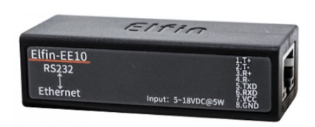
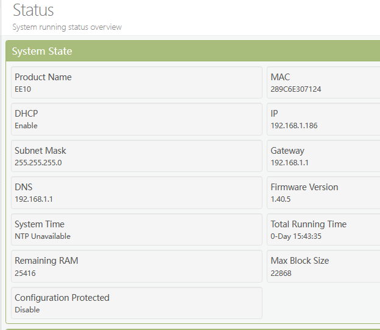
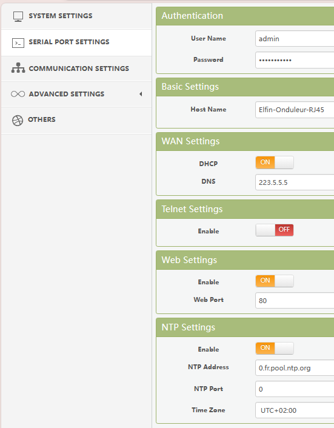
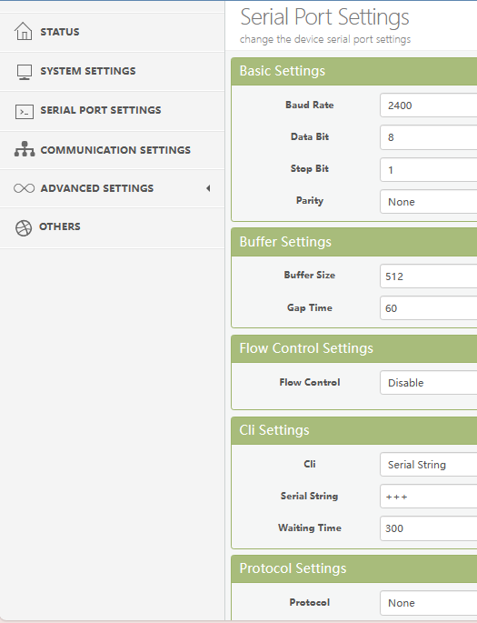
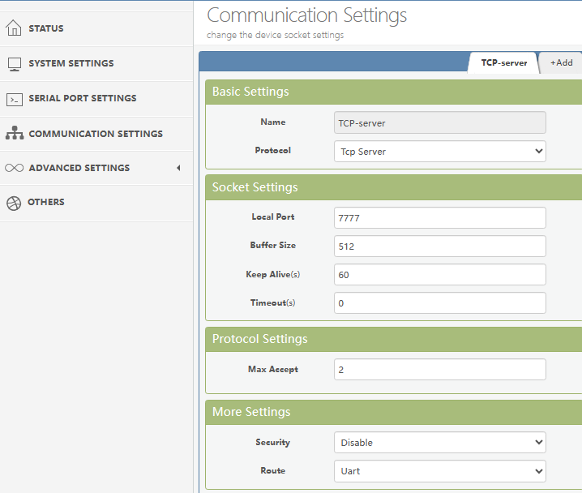
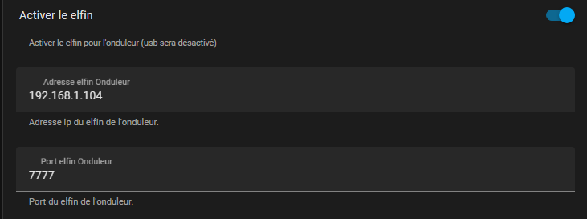
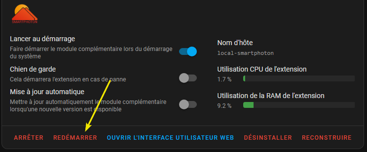
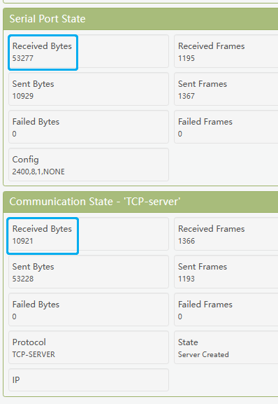

**Connexion d’un Elfin EE10 RJ45 à l’onduleur**

Pensez à mettre le firmware à jour si nécessaire. Il se trouve à cet [endroit](http://www.hi-flying.com/download-center-1/firmware-1/download-item-e10-e20-e30-ee10-ee11-hf5111b-hf5111s-hf5142b-hf6508-pe10-pe11-me20a-me21a-me22a-firwmare) 

***Dans un 1er temps il faut configurer le Elfin suivant les informations ci-dessous***

           

\***

***Setting du port série pour un onduleur type Voltronic :***

***Configuration du serveur TCP :***

***Dans un 2ème temps il faut configurer le module Smartphoton HA***

il faut définir l’adresse IP du module Elfin configuré ci-dessus ainsi que le port utilisé

L’adresse IP ci-dessous sera a changer avec celle de votre appareil Elfin !

Comme exemple :

Redémarrer le module complètement

Si tout fonctionne vous pouvez vérifier sur le Elfin qu’il y a bien des données qui sont reçues / émises sur le port série ainsi que sur le serveur TCP

