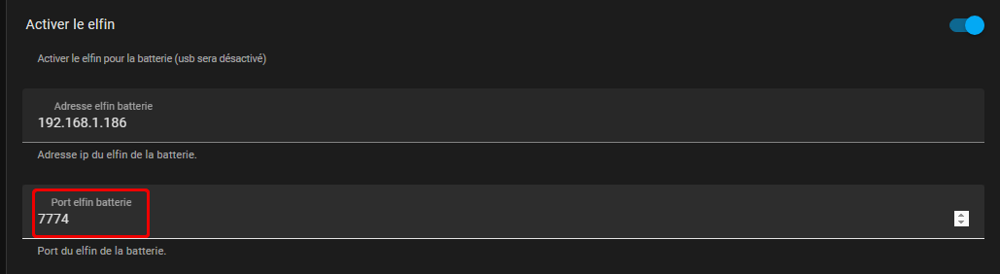

**Connexion d’un Elfin EE10 RJ45 à des batteries Pylontech**

Cela fonctionne avec des US2000B, US2000C, US3000,  US5000 

Pour les batteries H48050 allez voir ce [site](https://github.com/mletenay/home-assistant-pylontech) ou [celui-ci](https://github.com/hidaba/PylontechMonitoring)

Pensez à mettre le firmware à jour si nécessaire. Il se trouve à cet [endroit](http://www.hi-flying.com/download-center-1/firmware-1/download-item-e10-e20-e30-ee10-ee11-hf5111b-hf5111s-hf5142b-hf6508-pe10-pe11-me20a-me21a-me22a-firwmare) 

Dans un 1er temps il faut configurer le Elfin suivant les informations ci-dessous

                  

***Setting du port série pour batteries Pylontech :***

Surtout bien changer la valeur de «Gap Time» à 60 !

Configuration du serveur TCP :

Il faut modifier le «Buffer Size» à 1400. 

Si vous comptez vous connecter en parallèle depuis le réseau, mettez «Max Accept» à minium 2

***Dans un 2ème temps il faut configurer le module Smartphoton HA***

il faut définir l’adresse IP du module Elfin configuré ci-dessus ainsi que le port utilisé

L’adresse IP ci-dessous sera a changer avec celle de votre appareil Elfin !

Le **port IP doit être le même** que celui que vous avez configuré dans le Elfin

Comme exemple :

Redémarrer le module complètement

Si tout fonctionne vous pouvez vérifier sur le Elfin qu’il y a bien des données qui sont reçues / émises sur le port série ainsi que sur le serveur TCP

