**Installation de l’Add-on smartphoton dans Home Assistant**

Nous partons du postulat qu’Home Assistant est déjà installé et fonctionnel chez vous car il existe beaucoup de tuto très bien documenté et nous vous conseillons de vous y référer pour vous faciliter la tâche.

|L’installation de HAOS et fortement recommandée !|
| :-: |

Par exemple :

[Installation - Home Assistant (home-assistant.io)](https://www.home-assistant.io/installation/) 

Pour commencer, une fois dans HA, dans le menu de gauche, cliquez sur paramètres

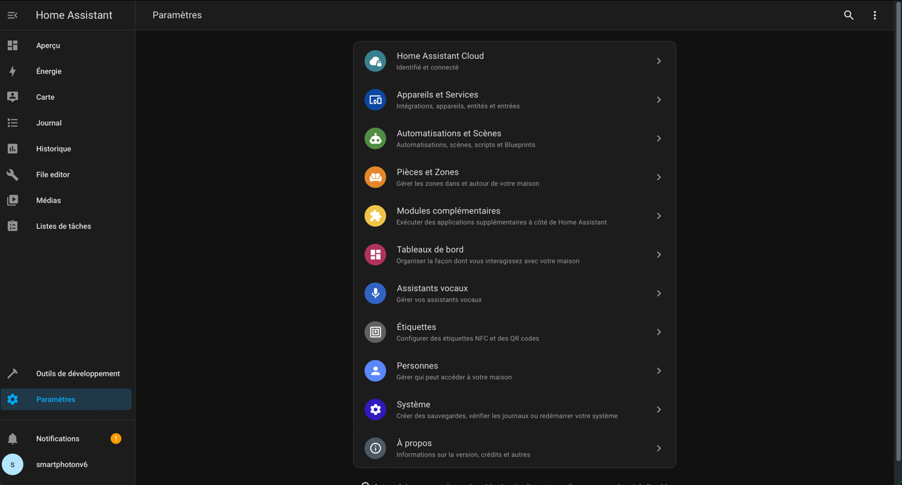

Modules complémentaires

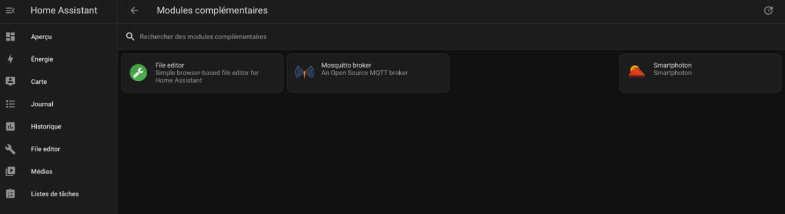

Ces 3 modules sont la base pour faire fonctionner votre smartphoton dans home assistant

Pour les installer, direction boutique des modules complémentaires et taper leur nom dans l’onglet recherche :

Mosquitto broker est un indispensable et permet de lire les messages envoyés par votre onduleur via MQTT

Cliquez sur mosquitto broker et installez le :

Puis allez dans configuration et rentrez les infos comme suit 

Attention gardez bien ces infos dans un coin car nous en aurons besoin plus tard !

Revenez à info et démarrez l’addon :

Voila une première étape simple réalisée

Si vous avez bien tout compris, vous pouvez faire la même chose avec « file editor » qui vous permet de prendre le contrôle de la configuration de Home Assistant.

Il ne nécessite pas de configuration particulière vous pouvez simplement l’installer et le démarrer.

Ca y est vous pouvez rentrer dans le monde de smartphoton featuring (en vedette avec) HA…

` `

Alors pour l’installation d’Add-on spécifique comme smartphoton qui n’est pas fourni originellement avec les dépôts de HA, il faut aller le chercher par le biais du github sur lequel il est hébergé.

Pour cela, il faut ajouter ce dépôt manuellement.

On reste toujours dans paramètres – modules complémentaires – boutiques des modules complémentaires

A cet endroit, cliquer sur les 3 points situés en haut à droite puis sur dépôts

Une fenêtre s’ouvre où vous pouvez ajouter la cible du dépôt de smartphoton : 

<https://github.com/jean-luc1203/smartphoton-ha-addon>

Cliquez sur ajouter et voilà c’est fait :

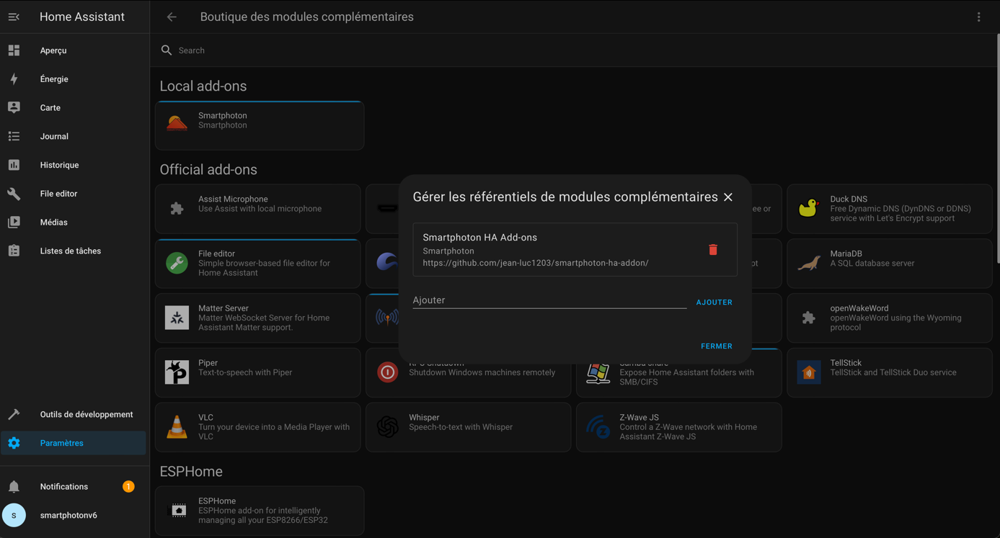

Vous devriez le découvrir ensuite ici (faire rafraîchir le navigateur Ctrl-F5 ou cmd+R):

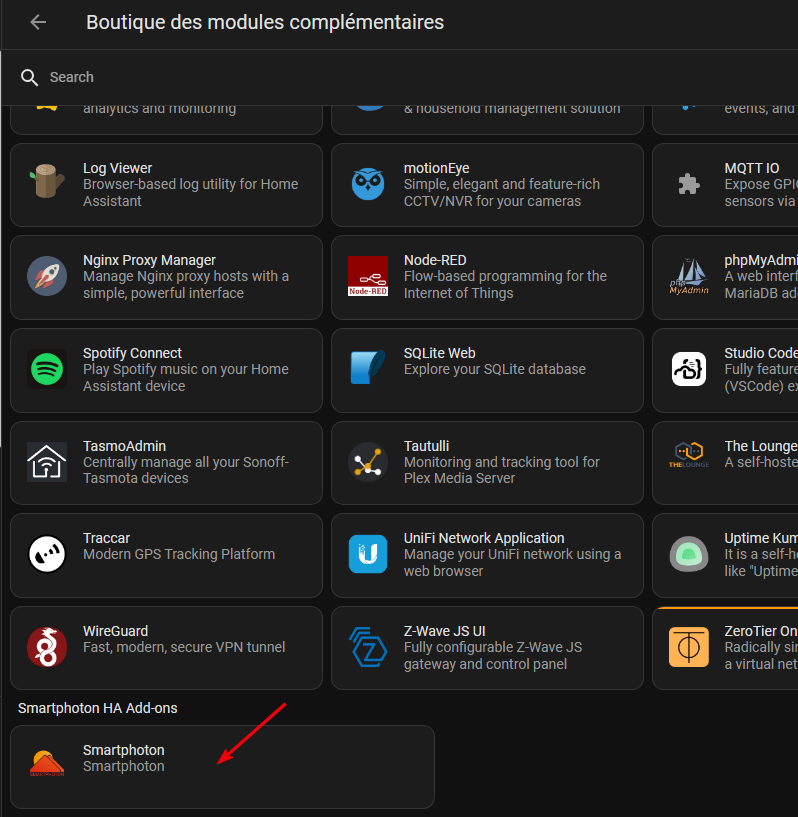

On s’approche de la vérité, il ne reste plus maintenant qu’à l’installer comme 

les autres Add-on et le configurer.

Donc on l’installe :

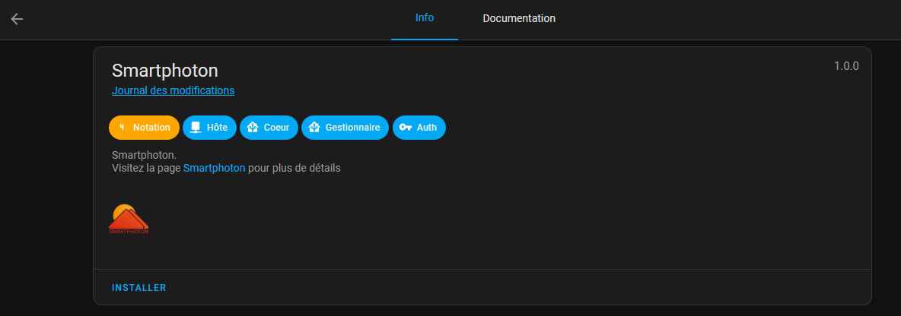

Pendant l’installation vous pouvez en profiter pour lire la documentation.

L’installation est longue (2-4 minutes)

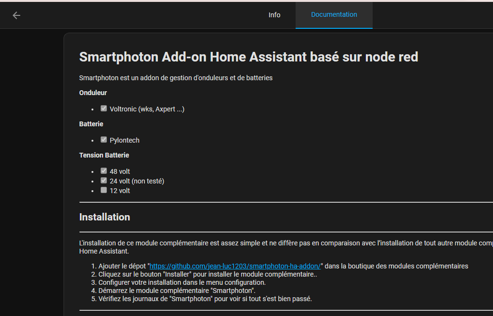

Pensez à activer le « chien de garde » celui-ci permet de relancer smartphoton en cas de défaillance du module. Ensuite aller dans les paramètres pour configurer votre add-on

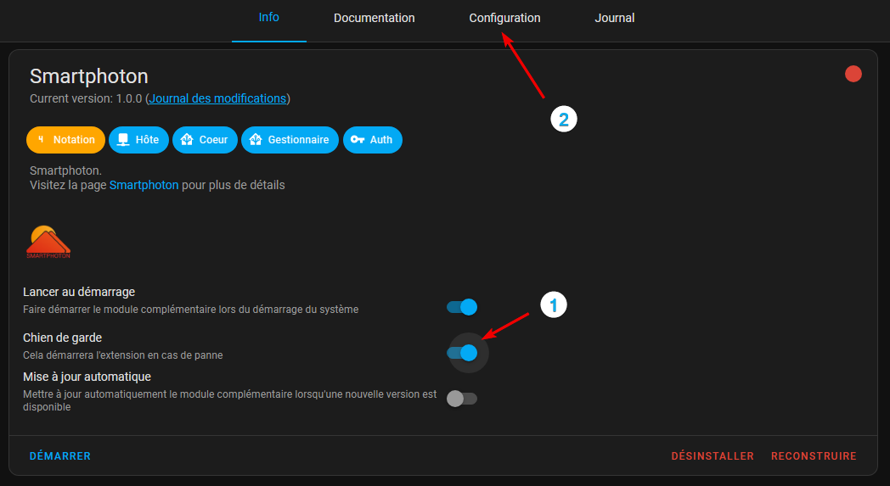

Voici un exemple de configuration :

Dans ce cas de figure, nous utilisons le port USB pour discuter avec l’onduleur en RS232 et une passerelle série / TCPIP Elfin pour transmettre les données du port Pylontech via le réseau de la maison. Ces passerelles peuvent être en [Ethernet](http://www.hi-flying.com/elfin-ee10-elfin-ee11) ou en [Wifi](http://www.hi-flying.com/elfin-ew10-elfin-ew11) avec ou sans antenne extérieure

Pour pouvoir récupérer le chemin complet où se trouve le port USB utilisé, veuillez procéder comme suit. 

Aller dans le menu « Système-Matériel-Tout le matériel »

Faite glisser l’ascenseur jusqu’à trouver le bon port USB utilisé par votre convertisseur série et copier le chemin pour le coller ensuite dans la configuration ci-après

Par exemple :

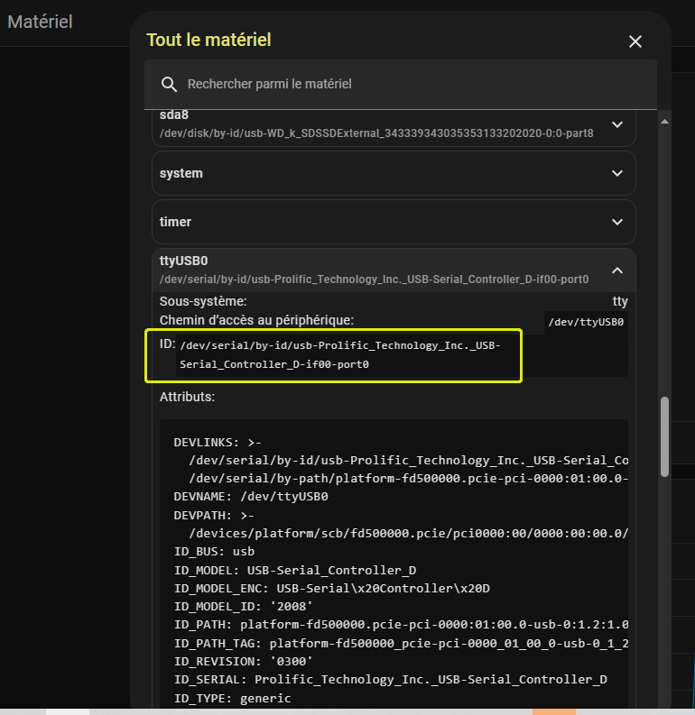

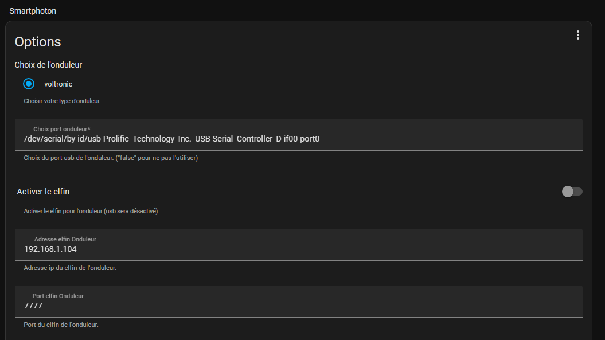

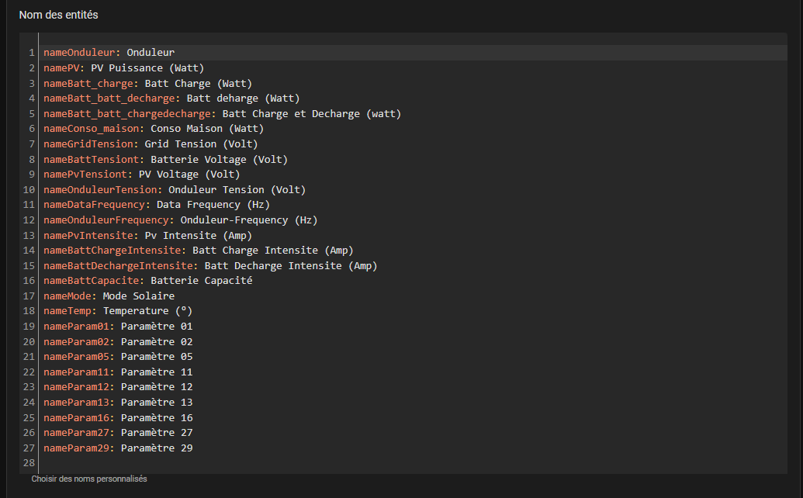

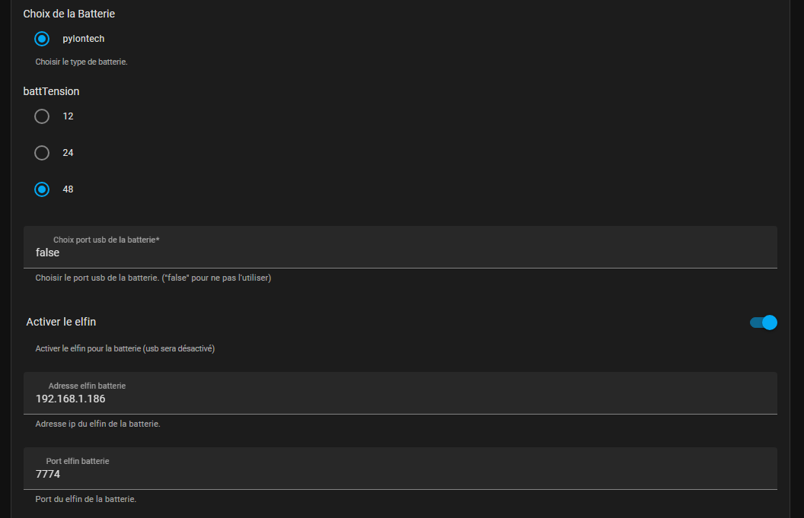

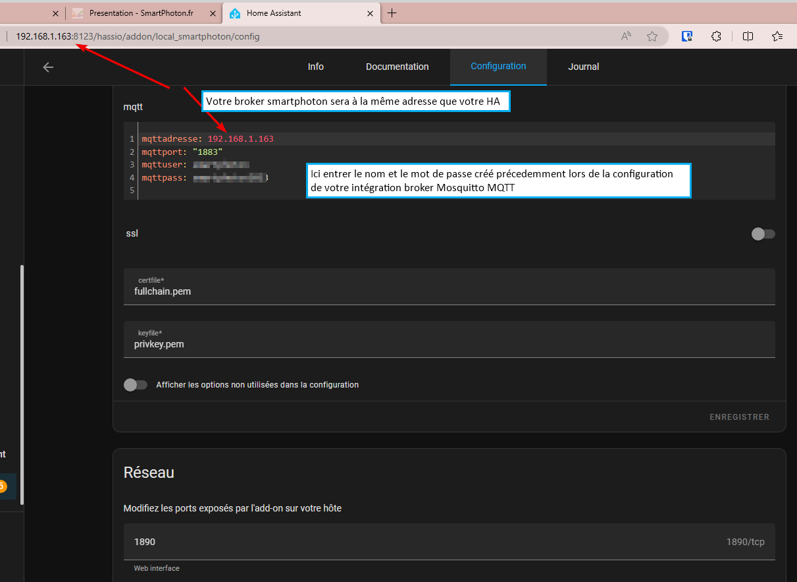

Une fois votre configuration effectuée, lancer le module. Vous pouvez vérifier le bon déroulement dans le journal.

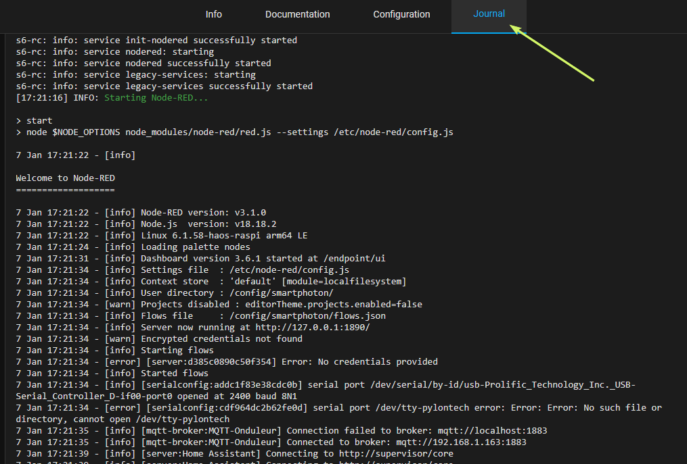

Pour trouver vos différentes valeurs une fois que la configuration est faite. Allez sur la page des intégrations et cliquez sur MQTT

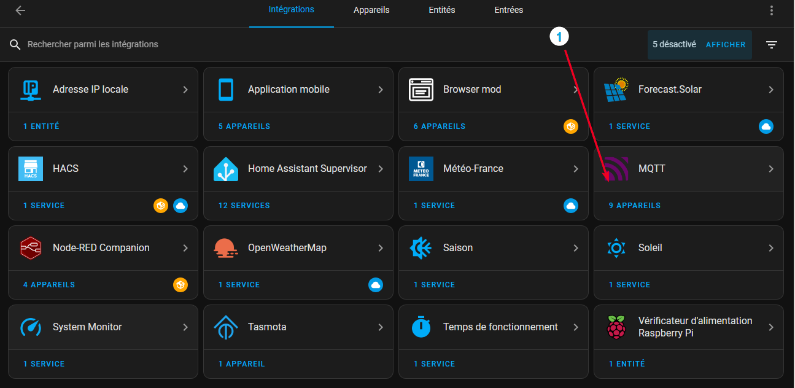

cliquez sur appareils

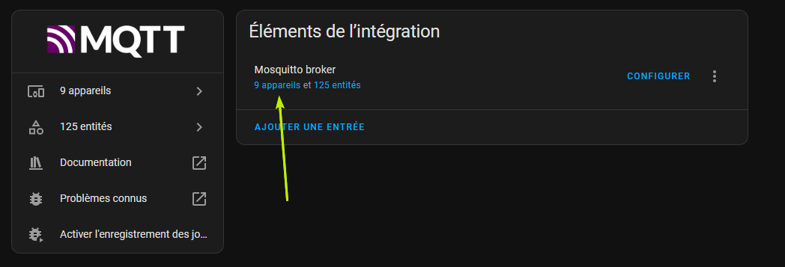

Voici apparaître (si tout est ok) vos divers appareils. A savoir votre onduleur et votre (vos) batteries. 

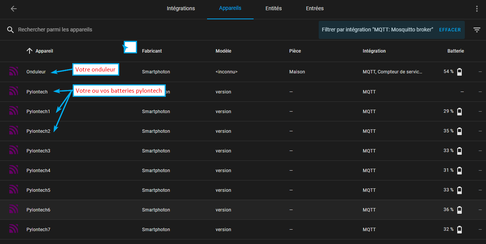

Cliquez sur par exemple Onduleur pour voir les divers compteurs (entités sous HA) récupérés par smartphoton que vous pourrez ensuite ajouter à vos tableaux de bord.

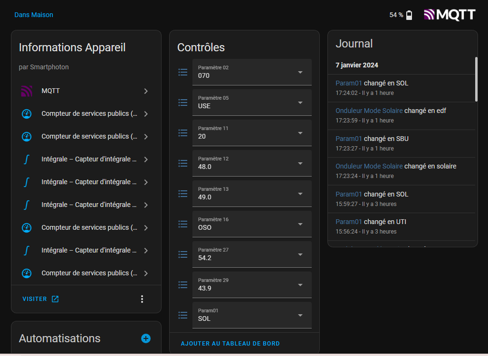

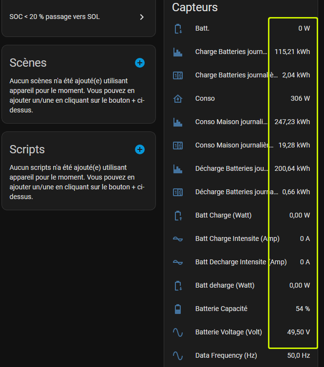

Voilà l’installation est terminée.

A vous le plaisir de configurer ensuite vos tableaux de bords et vos automatisations 

